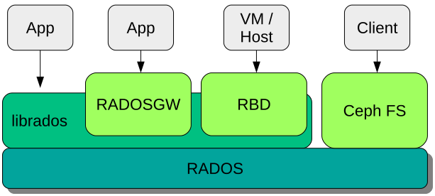
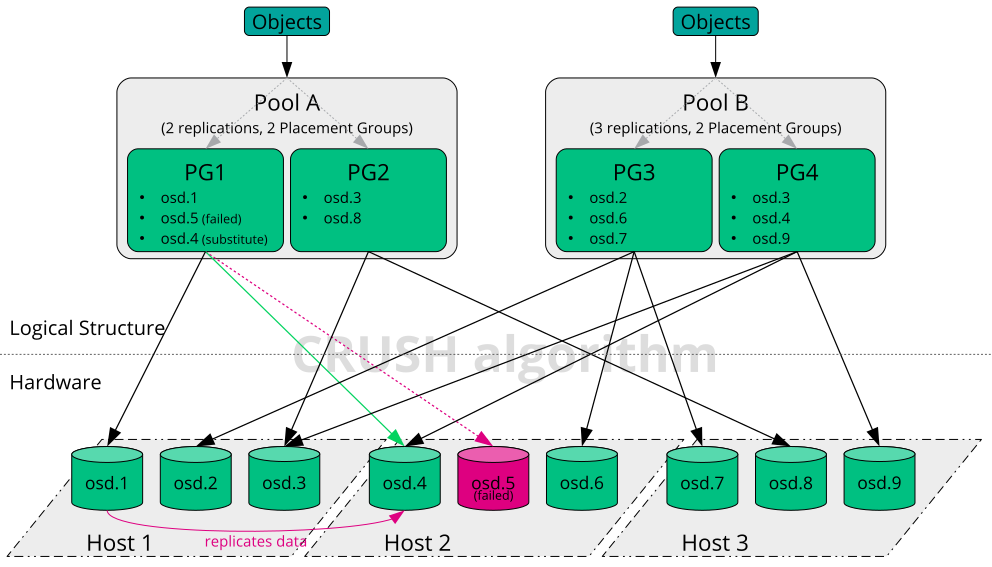
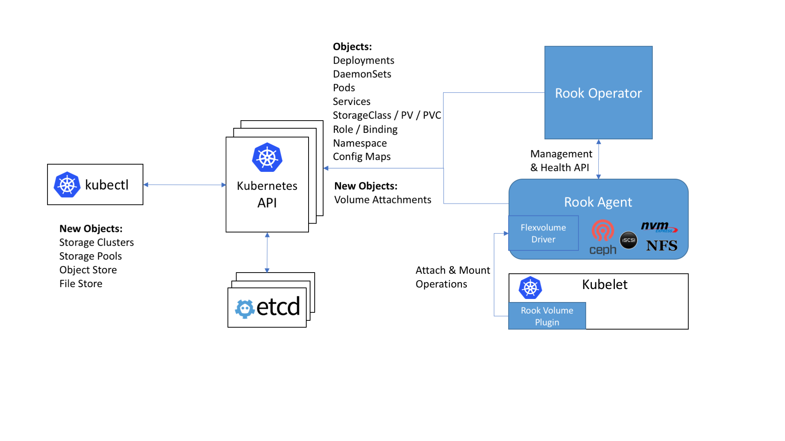

## Ceph is a distributed storage system

+ designed for scalability, reliability and performance
+ can be run on commodity servers in a common network
+ scales up well to thousands of servers
+ automates management tasks such as
  + data distribution and redistribution
  + data replication
  + failure detection and recovery
+ both self-healing and self-managing

--

### Reliable Autonomic Distributed Object Store



--

### Controlled Replication Under Scalable Hashing



---

## [rook.io](https://rook.io)

+ Rook is an open source cloud-native storage orchestrator that turns storage software into the storage services that are
  + self-managing
  + self-scaling
  + self-healing
+ It does this by automating 
  + deployment, bootstrapping, configuration, provisioning, scaling, upgrading, migration, disaster recovery, monitoring, and resource management. 

--


--

### Rook Design



---

## openSUSE Ceph

+ [openSUSE:Ceph](https://en.opensuse.org/openSUSE:Ceph) wiki page
+ OBS projects [filesystems:ceph](https://build.opensuse.org/project/show/filesystems:ceph)
+ [subprojects](https://build.opensuse.org/project/subprojects/filesystems:ceph) like [filesystems:ceph:nautilus](https://build.opensuse.org/project/show/filesystems:ceph:nautilus)
+ Process
  + development version of Ceph [filesystems:ceph:octopus](https://build.opensuse.org/project/show/filesystems:ceph:octopus)
  + submitted to [filesystems:ceph](https://build.opensuse.org/project/show/filesystems:ceph)
  + [filesystems:ceph](https://build.opensuse.org/project/show/filesystems:ceph) is submitted to Factory
  + stable version now is [filesystems:ceph:nautilus](https://build.opensuse.org/project/show/filesystems:ceph:nautilus)

--

### openSUSE Ceph containers

+ rook-ceph-image is Rook container for Ceph
+ ceph-image is a Ceph container that contains all need packages
  + ceph (osd, mon, mgr, mds)
  + ceph-mgr-dashboard
  + ceph-mgr-rook
  + ceph-radosgw
  + nfs-ganesha

--

### openSUSE Ceph containers process

+ Process plan is to follow [openSUSE Building derived containers](https://en.opensuse.org/Building_derived_containers)
  + submit containers from [filesystems:ceph](https://build.opensuse.org/project/show/filesystems:ceph) to openSUSE:Factory
  + submit containers from [filesystems:ceph:nautilus](https://build.opensuse.org/project/show/filesystems:ceph:nautilus) to openSUSE:Leap:15.1:Images

---

## Development cluster on Vagrant

+ [vagrant-ceph](https://github.com/openSUSE/vagrant-ceph) openSUSE project
+ [openSUSE:Ceph](https://en.opensuse.org/openSUSE:Ceph) wiki page
  + [Rook in Vagrant cluster](https://en.opensuse.org/openSUSE:Ceph#Using_Rook_in_Vagrant_cluster)

--

### vagrant-ceph

+ follow instruction on wiki or github to use [vagrant-ceph](https://github.com/openSUSE/vagrant-ceph)
+ box could be found in [openSUSE:Factory/openSUSE-MicroOS](https://build.opensuse.org/package/binaries/openSUSE:Factory/openSUSE-MicroOS:Kubic-kubeadm-Vagrant/images)
```bash
vagrant box add --provider libvirt --name opensuse/Kubic-kubeadm-cri-o Kubic.box
BOX="opensuse/Kubic-kubeadm-cri-o" vagrant up
vagrant ssh admin
sudo su
kubectl get nodes
NAME    STATUS   ROLES    AGE   VERSION
admin   Ready    master   89s   v1.14.1
data1   Ready    <none>   47s   v1.14.1
mon1    Ready    <none>   51s   v1.14.1
```

--

### vagrant-ceph k8s deployment

```yaml
      admin:
        - getent hosts admin-management | awk '{ print $1}' | xargs kubeadm init --cri-socket=/var/run/crio/crio.sock --pod-network-cidr=10.244.0.0/16 --token 56fa9a.705a6001db6a6756 --skip-token-print --apiserver-advertise-address

        - mkdir -p $HOME/.kube; cp -i /etc/kubernetes/admin.conf $HOME/.kube/config; chown $(id -u):$(id -g) $HOME/.kube/config
        - kubectl apply -f https://0y.at/kubicflannel
        - kubectl taint nodes admin node-role.kubernetes.io/master::NoSchedule-

        - curl -LkSs https://api.github.com/repos/SUSE/rook/tarball/suse-master -o /home/vagrant/rook.tar.gz
        - tar -xzf /home/vagrant/rook.tar.gz -C /home/vagrant

      all:
        - ( ( if [ "$HOSTNAME" != "admin" ]; then kubeadm join --token 56fa9a.705a6001db6a6756 --discovery-token-unsafe-skip-ca-verification admin-management:6443 >>/home/vagrant/join 2>&1; fi; ) & )
```

--

### vagrant-ceph Rook deployment

admin#
```bash
cd SUSE-rook*/cluster/examples/kubernetes/ceph/

kubectl create -f common.yaml -f psp.yaml -f operator.yaml

kubectl create -f cluster.yaml -f toolbox.yaml

kubectl -n rook-ceph get pod

```

--

### vagrant-ceph Rook deploys Ceph cluster

```bash
kubectl -n rook-ceph exec $(kubectl -n rook-ceph get pod -l "app=rook-ceph-tools" -o jsonpath='{.items[0].metadata.name}') -- ceph -s
  cluster:
    id:     3d3eb9ab-7416-474d-8e28-fe673f23bd3e
    health: HEALTH_OK

  services:
    mon: 3 daemons, quorum a,b,c (age 4m)
    mgr: a(active, since 3m)
    osd: 6 osds: 6 up (since 3s), 6 in (since 3s)
 
  data:
    pools:   0 pools, 0 pgs
    objects: 0 objects, 0 B
    usage:   6.0 GiB used, 108 GiB / 114 GiB avail
    pgs:
```

--

### vagrant-ceph Rook defaults

+ by default it is a _tiny_ cluster from 3 nodes
  + check ``Vagrant`` file and ``config.yml`` for more options
+  Vagrant changes default containers in yaml (image: key) to
  + ``registry.opensuse.org/filesystems/ceph/images/rook/ceph:latest``
  + ``registry.opensuse.org/filesystems/ceph/images/ceph:latest``
+ [SUSE Rook fork](http://github.com/suse/rook) is at ``github.com/suse/rook_ and _suse-master`` branch

---

## CI cluster on Openstack

+ Terraform, Heat Orchestration Template, and etc
+ Heat is supported not on all Cloud instances
+ HOT approach has less tools in the middle so less failures and easier to analyze them
+ Templates examples could be found [here](https://github.com/denisok/ceph-kubic-stack)

--

### Creating k8s cluster on Openstack

host#
```bash
openstack stack create -t ./ceph-kubic-stack.yaml -e ./ceph-kubic-environment.yaml --parameter keypair=key--wait ceph-kubic

MasterIP=$(openstack stack output show ceph-kubic master-floating-network-ip -c output_value -f value)
```
master#
```bash
kubeadm init --cri-socket=/var/run/crio/crio.sock --pod-network-cidr=10.244.0.0/16

mkdir -p $HOME/.kube; cp -i /etc/kubernetes/admin.conf $HOME/.kube/config; chown $(id -u):$(id -g) $HOME/.kube/config

kubectl apply -f https://0y.at/kubicflannel
ubectlJoin=$(kubeadm token create --print-join-command)

ssh nodes $KubectlJoin
```

--

### Rook deployment

master# 
```bash
cd rook/cluster/examples/kubernetes/ceph/

kubectl create -f common.yaml -f psp.yaml

kubectl get crd | grep cephclusters
cephclusters.ceph.rook.io           2019-05-23T15:15:14Z

kubectl -n rook-ceph get cephcluster | grep Created
kubectl -n rook-ceph get cephcluster | grep HEALTH_OK

NAME        DATADIRHOSTPATH        MONCOUNT AGE STATE     HEALTH
rook-ceph   /home/ses/var/lib/rook   3      10m Created   HEALTH_OK
```

--

### Gathering info and shutdown

master#
```bash
kubectl -n rook-ceph get pods
kubectl -n rook-ceph describe pods
kubectl -n rook-ceph logs -lapp=rook-ceph-operator
kubectl -n rook-ceph logs -lapp=rook-ceph-...

cp -R /var/log/containers/* ...
```
host#
```bash
openstack stack delete --yes --wait ceph-kubic
```

---

## other tools

+ [terraform-kubic-kvm](https://github.com/kubic-project/kubic-terraform-kvm)
+ [minikube and coreos-kubernetes fork](https://rook.io/docs/rook/v1.0/k8s-pre-reqs.html)

---

## Bugs

+ Some nodes in cluster don't boot
  + [bug #1133514](https://bugzilla.opensuse.org/show_bug.cgi?id=1133514)
  + needs SUSE [bug #1134472](https://bugzilla.suse.com/show_bug.cgi?id=1134472) to be fixed
  + workaround images are here [home:favogt:dracutfix](https://build.opensuse.org/project/show/home:favogt:dracutfix)
+ cloud-init or SOC has some bug with routing for second interface
  + [bug #1135792](https://bugzilla.suse.com/show_bug.cgi?id=1135792)
  + disabled second network as workaround

---

## Contribute

- https://github.com/ceph/ceph Ceph
- https://github.com/rook/rook/ Rook
- https://build.opensuse.org/project/show/filesystems:ceph OBS project
- https://en.opensuse.org/openSUSE:Ceph wiki page


